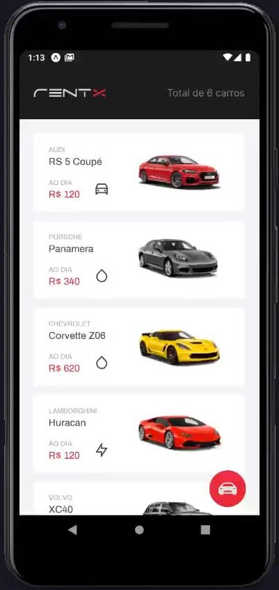

<h1 align="center">
  
</h1>

  
  
  
  
  
  

# Ignite_React-Native_Activity_02

React Native activity done with 'Rocketseat' Ignite course. ("Chapter II, III, IV, V and VI")

## 💻 Sobre o capítulo II - Expo e Styled Components, Formulários e Navegação, Async Storage, Contextos e Autenticação.

Neste capítulo criaremos uma aplicação completa utilizando React Native, TypeScript e Styled Components (CSS-in-JS) para ir mais a fundo em 
estilização e criação de interfaces no React Native baseando-se em um layout do Figma. Você também irá aprender a utilizar API Nativas, 
Armazenamento Local com Async Storage, Navegação, Formulários e Login Social. E para dar um Booster na produtividade vamos utilizar o 
Expo Bare Workflow.

## 💻 Sobre o capítulo III - Consumindo API, Animações.

Nesse capítulo, integraremos a aplicação React Native com uma API. Você irá compreender os métodos do protocolo HTTP, lidar com requisições
e respostas realizadas a uma API. Para integrar e consumir API utilizaremos o Axios.
Conhecer e aplicar na prática ferramentas e técnicas que estarão presentes nas suas aplicações no futuro aplicando boas práticas de UX e Animações.

## 💻 Sobre o capítulo IV - Offline First

Nesse capítulo implementaremos a estratégia de Offline First para que algumas funcionalidades da nossa aplicação funcionem sem conexão com internet
utilizando um banco de dados local mais robusto.

## 💻 Sobre o capítulo V - Testes no React Native, Performando Apps

Nesse capítulo vamos entender como criar testes automatizados no React Native garantindo que nossos componentes e funcionalidades continuem funcionando
independente de novas manutenções. E também, irá aprender como performar suas aplicações.

## 💻 Sobre o capítulo VI - Publicação de Apps, Fluxo de CI/CD

Nesse capítulo vamos entender as técnicas de publicação de Apps e compreender como realizar o deploy de nossas aplicações com o fluxo de CI/CD.

<h1 align="center">
     
     
     
</h1>
